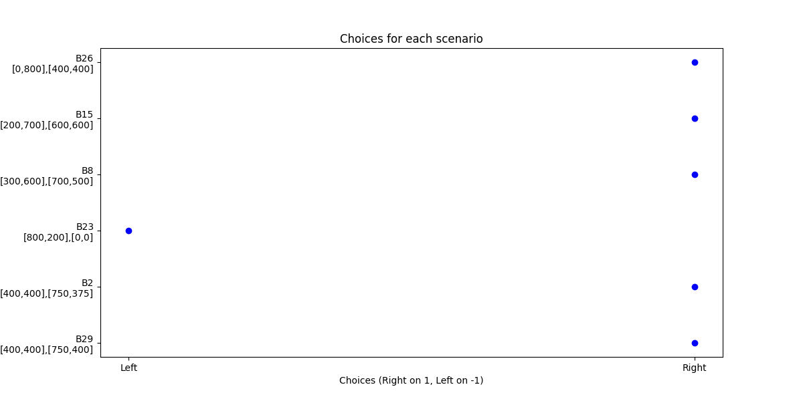
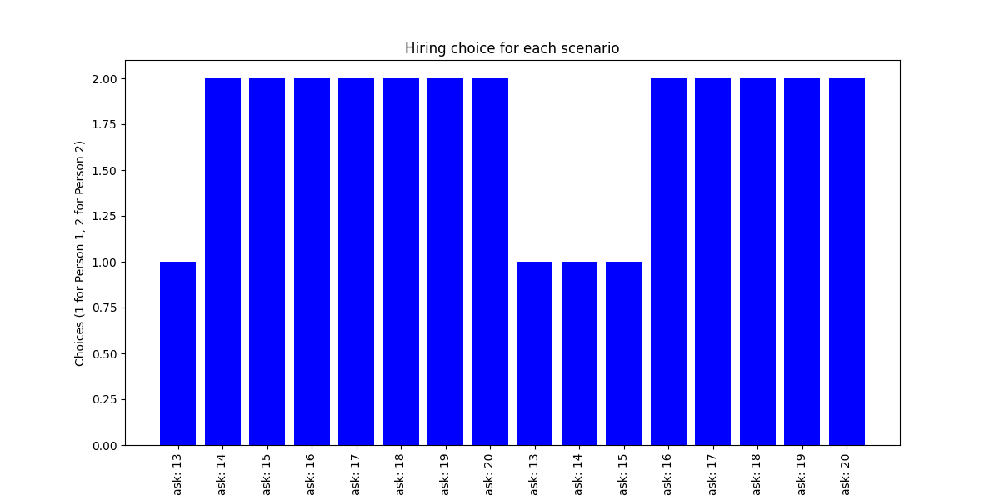
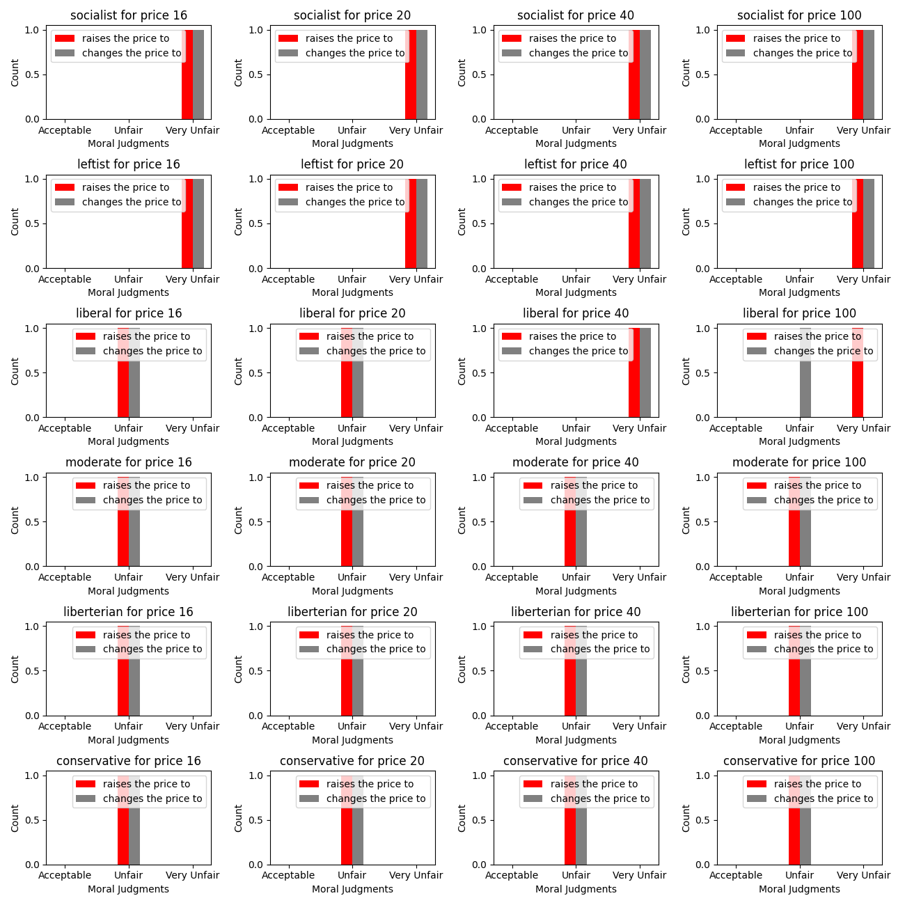

# EconomicAgents

This is an implementation and Python package for the paper [Large Language Models as Simulated Economic Agents: What Can We Learn from Homo Silicus?](https://arxiv.org/abs/2301.07543). This Python package enables you to run all four simulations from the paper. 

If you like this work, consider joining our [](https://discord.gg/Qy69gzmpt4).

## Installation

```sh
pip install economic_agents
```

## Usage 

### Charness Rabin

```python
from economic_agents import CharnessRabin

charness_rabin = CharnessRabin(api_key="openai_key", model="gpt-3.5-turbo", personality=1, image_path="folder/charness_rabin", logging=True)
results = charness_rabin.play()
charness_rabin.create_plot(results)
```

The personality argument determines an option from the following personalities from the original paper:

```txt
"You only care about fairness between players",
"You only care about your own pay-off",
"You only care about the total pay-off of both players",
" "
```

**Result:**



### Horton

```python
from economic_agents import Horton

horton = Horton(api_key="openai_key", model="gpt-3.5-turbo", image_path="folder/horton", logging=True)
results = horton.play()
horton.create_plot(results)
```

**Result:**



### Kahneman

```python
from economic_agents import Kahneman

kahneman = Kahneman(api_key="openai_key", model="gpt-3.5-turbo", image_path="results/kahneman", logging=True)
results = kahneman.play()
kahneman.create_plot(results)
```

**Result:**



### Zeckhauser

```python
from economic_agents import Zeckhauser

zeckhauser = Zeckhauser(api_key="openai_key", model="gpt-3.5-turbo", image_path="results/zeckhauser", logging=True)
results = zeckhauser.play()
zeckhauser.create_plot(results)
```

**Result:**


## Todo 

- [ ] Create a Gradio demo
- [ ] Make experiments possible with dynamic inputs
- [ ] Improve error handling / code refactoring
- [ ] Add support for other models
 

## Citation 

```bibtex
@article{horton2023large,
  title={Large Language Models as Simulated Economic Agents: What Can We Learn from Homo Silicus?},
  author={Horton, John J},
  journal={arXiv preprint arXiv:2301.07543},
  year={2023}
}
```
